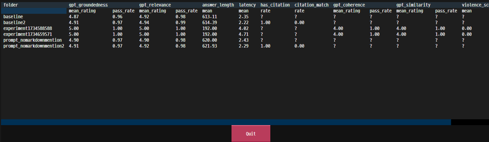
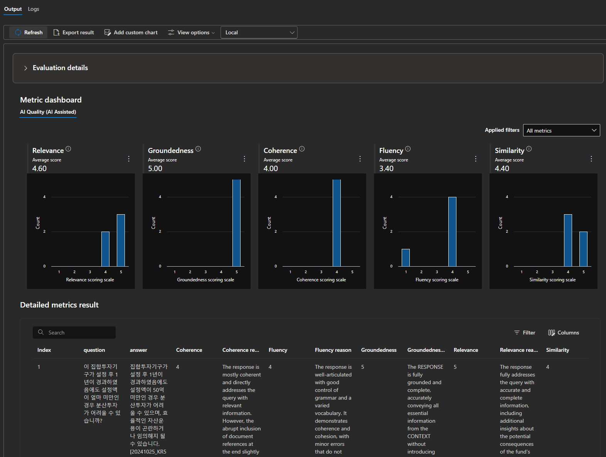

# RAG Evaluation Framework

이 Repo에는 RAG(Retrieval-Augmented Generation) 앱앱을 평가하기 위한 프레임워크가 포함되어 있으며 다음과 같은 특징이 있음.

1. 한국어 RAG앱을 위한 한국어 질문 생성 자동화
2. Local Evaluation와 Custom 메트릭 측정 자동화. Builtin Evaluation 추가 정의 방법
3. Builtin Evaluation을 사용 시 Azure AI Project에서 중앙집중 logging.

이 프레임워크는 다음과 같은 기능을 제공함.

1. RAG 앱을 평가하기 위한 Question, Ground Truth 데이터셋 자동생성
2. 데이터셋을 가지고 우리의 RAG를 호출해서 answer가 어떤지 받아오기.
2. RAG 앱앱 평가하기 위한 Builtin Evaluator사용
3. RAG 앱을 평가하기 위한 Custom Evaluator 구현
4. 평가 결과 확인 (로컬)
5. Azure AI Project의 결과 전송

## Getting Started

```bash
pip install -e .
```

## Quick start with Notebook

[evaluation_azure_sdk](./notebook/evaluation_azure_sdk.ipynb)를 이용하여 Evaluation의 메커니즘을 빠르게 파악할 수 있음


## 합성 질문/답변 생성

* AI Search Index 데이터의 Chunk (row)별 데이터를 읽어 질문지와 Ground Truth를 생성.

* [`QADataGenerator`](https://learn.microsoft.com/en-us/python/api/azure-ai-generative/azure.ai.generative.synthetic.qa.qadatagenerator?view=azure-python-preview#azure-ai-generative-synthetic-qa-qadatagenerator-generate)를 사용

> [!Note]
> `azure.ai.evaluation.simulator`를 통해 생성할 수도 있음.
> https://learn.microsoft.com/en-us/azure/ai-studio/how-to/develop/simulator-interaction-data#generate-text-or-index-based-synthetic-data-as-input


* 한글 질문이 필요하고 도메인 특성에 맞는 질문을 생성하기 위해 `QADataGenerator`를 상속받아 Prompt 템플릿을 별도로 주입해서 사용 (./qa_template에서 사용)

    ```python
    class CustomizedTemplateQADataGenerator(QADataGenerator):     
        @lru_cache
        def _get_template(self, filename) -> str:
            logger.debug("Getting prompt template from %s file", filename)
            filepath = os.path.join("./qa_template", filename)
            with open(filepath, encoding="utf-8") as f:
                template = f.read()
            return template
    ```

* `.env_sample` 파일을 복사하여 `.env` 파일을 생성하고, 환경 변수 설정

    ```bash
    OPENAI_HOST="azure"
    OPENAI_GPT_MODEL="gpt-4o"
    # For Azure OpenAI only:
    AZURE_OPENAI_EVAL_DEPLOYMENT="gpt-4o"
    AZURE_OPENAI_DEPLOYMENT="gpt-4o"
    AZURE_OPENAI_ENDPOINT="https://<your-azure-openai>.openai.azure.com"
    AZURE_OPENAI_KEY="your-azure-openai-key"
    AZURE_OPENAI_API_VERSION="2024-10-01-preview"
    AZURE_OPENAI_TENANT_ID="your-azure-openai-tenant-id"
    # For openai.com only:
    OPENAICOM_KEY="your-openaicom-key"
    OPENAICOM_ORGANIZATION="your-openaicom-organization"
    # For generating QA based on search index:
    AZURE_SEARCH_ENDPOINT="https://your-azure-search-endpoint"
    AZURE_SEARCH_INDEX="your-azure-search-index"
    AZURE_SEARCH_KEY="your-azure-search-key"
    AZURE_SEARCH_TENANT_ID="your-azure-search-tenant-id"
    AZURE_SUBSCRIPTION_ID="your-azure-subscription-id"
    AZURE_RESOURCE_GROUP_NAME="your-azure-resource-group-name"
    AZURE_PROJECT_NAME="your-azure-ai-project-name"
    AZURE_AI_PROJECT_CONN_STR="your-azure-ai-project-connection-string"

    ```

* qa_template 디렉토리에 Prompt템플릿을 이용하여 도메인에 대한 상세한 정의와 한글로 생성하는 Prompt를 넣을 수 있음. 

    * `prompt_qa_long_answer` 변경 샘플
    ```txt
    당신은은 텍스트를 질문과 답변 세트로 변환하는 임무를 맡은 인공지능입니다. 질의응답 세트에서 가능한 한 많은 세부 사항을 텍스트에 포함시켜야 합니다.
    질문과 답변은 모두 주어진 텍스트에서 추출해야 합니다.
    답변은 길어야 하지만 3~4문장을 넘지 않아야 합니다.
    질문은 텍스트에서 가능한 한 상세해야 합니다.
    질문은 한국어로 작성되어야 합니다.
    출력에는 항상 제공된 개수의 QnA가 있어야 합니다.
    ...
    ```
    * 기타 다른 Prompt를 사용할 수 있으며 QAType에서 정의된 타입에 따라 Prompt를 사용할 수 있음.

    ```python
    qa_generator = CustomizedTemplateQADataGenerator(model_config=openai_config)
    qa_generator.generate(
            text=source_to_text(source),
            qa_type=QAType.LONG_ANSWER,
            num_questions=num_questions_per_source,
        )
    ```

    * QAType Prompt 템플릿

        | QAType                | 설명                                              | 템플릿 파일                    |
        |-----------------------|--------------------------------------------------|--------------------------------|
        | `QAType.SHORT_ANSWER` | 짧은 답변 질문 생성                              | `prompt_qa_short_answer.txt`   |
        | `QAType.LONG_ANSWER`  | 상세한 답변 질문 생성                            | `prompt_qa_long_answer.txt`    |
        | `QAType.BOOLEAN`      | 예/아니오 유형의 질문 생성                       | `prompt_qa_boolean.txt`        |
        | `QAType.SUMMARY`      | 요약 유형의 질문 생성                            | `prompt_qa_summary.txt`        |
        | `QAType.CONVERSATION` | 대화 기반 질문 생성                              | `prompt_qa_conversation.txt`   |

        각 QAType은 해당 유형의 질문과 답변을 생성하는 방법을 정의하는 특정 프롬프트 템플릿 파일에 해당함. 이러한 템플릿은 RAG 애플리케이션의 도메인과 요구 사항에 맞게 사용자 정의할 수 있음. 

* Configuration 정의
    1. 로컬 수행 용 Evaluation Metric정의: `requested_metrics`
    2. RAG 앱 엔드포인트 정의: `target_url`

    ```json
        {
            "testdata_path": "example_input/qa.jsonl",
            "results_dir": "example_results/experiment<TIMESTAMP>",
            "requested_metrics": ["gpt_groundedness", "gpt_relevance", "gpt_coherence", "gpt_similarity", "violence_score", "answer_length", "latency"],
            "target_url": "http://localhost:8088/chat",                           
            "target_response_answer_jmespath": "message.content",
            "target_response_context_jmespath": "context.data_points.text"
        }

    ```

> [!Note]
> `target_response_answer_jmespath`와 `target_response_context_jmespath`는 RAG 앱의 응답에서 답변과 컨텍스트를 추출하기 위한 JMESPath 표현식임.


* 예상 질문/답변 생성 (Chunk(row)별로 5개의 질문/답변 생성, 총 10개)

    ```bash
        python -m evaltools generate --output=example_input/qa.jsonl --persource=5 --numquestions=10
    ```

## Evaluation 수행

### 커스텀, 빌트인 Evaluator를 이용한 Local Evaluation 

> [!Important]
> 이 기능은 [ai-rag-chat-evaluator](https://github.com/Azure-Samples/ai-rag-chat-evaluator) 프로젝트를 참고하여 구현되었음.
> Azure AI Project 표준화된 메트릭이 아닌 Customized 메트릭 사용함.  


* [local_evaluation_with_custom_metric.md](./local_evaluation_with_custom_metric.md) 파일 참고

#### Violence Evaluator 추가 샘플

* `ViolenceEvaluator` 인스턴스를 만드는 `evaluate_fn` 메소드를 구현하고 어떤 집계 메트릭을 산출할 것인지에 대한 `get_aggregate_stats` 구현

>![Note]
>ViolenceEvaluator 정보는 https://learn.microsoft.com/en-us/python/api/azure-ai-evaluation/azure.ai.evaluation.violenceevaluator?view=azure-python


    ```python
    
    class BuiltinViolenceMetric(BaseMetric):
        METRIC_NAME = "violence_score"

        @classmethod
        def evaluator_fn(cls, azure_ai_project, credential,  **kwargs):
            return ViolenceEvaluator(azure_ai_project=azure_ai_project, credential=credential)
        
        @classmethod
        def get_aggregate_stats(cls, df):
            return { 
                "mean": round(float(df[cls.METRIC_NAME].mean()), 2), 
                "max": round(float(df[cls.METRIC_NAME].max()), 2), 
                "min": round(float(df[cls.METRIC_NAME].min()), 2), 
            }
        
    ```

#### Evaluation 수행

    ```bash
        python -m evaltools evaluate --config=example_config.json --numquestions=100
    ```

### Azure AI evaluation의 `evaluate` 메소드를 이용한 표준화된 메트릭 사용

> [!Note]
> TODO 환경변수로 실행여부 컨트롤

* 사용할 evaluator및 컬럼 매핑
* `evaluate.py` 샘플 코드 참고

    ```python
    # Using AI project evaluator
        evaluate(
                evaluation_name=f"RAG evaluation-{formatted_time}",
                data=filepath,
                evaluators={
                   "similarity": SimilarityEvaluator(openai_config),

                }, 
                evaluator_config={                   
                    "similarity": {
                        "column_mapping": {
                            "query": "${data.question}",
                            "response": "${data.answer}",
                            "ground_truth": "${data.truth}",
                        } 
                    }
                },

                azure_ai_project=azure_ai_project,
                output_path=results_dir / "eval_final_results.json"
            )
        
    ```

* AI Project Client를 이용하여 결과 업로드

    ```python
        project_client = AIProjectClient.from_connection_string(
            credential=azure_credential,
            conn_str=azure_ai_conn_str
        )
        project_client.upload_file(results_dir / "eval_final_results.json")
    ```

## Evaluation결과 확인

### Local Evaluation 결과 확인

```bash
python -m evaltools summary example_results
```     

* Local 결과 확인


* Azure AI Studio 결과 확인


## Reference

* Azure AI Evaluation library for Python: https://learn.microsoft.com/en-us/python/api/overview/azure/ai-evaluation-readme?view=azure-
* Azure AI Evaluation SDK: https://learn.microsoft.com/en-us/azure/ai-studio/how-to/develop/evaluate-sdk
* RAG Evaluator: https://github.com/Azure-Samples/ai-rag-chat-evaluator

